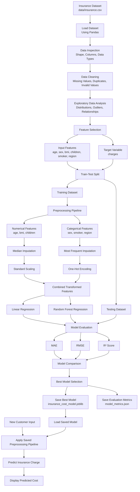

# Insurance EDA and Cost Prediction


An end-to-end data analytics and machine-learning project that analyses medical insurance data and predicts individual insurance charges using regression models.

The project includes data inspection, exploratory data analysis, preprocessing, model training, performance evaluation, model comparison, serialization, and reusable prediction.

---

## Table of Contents

* [Project Overview](#project-overview)
* [Project Objectives](#project-objectives)
* [Dataset](#dataset)
* [Repository Structure](#repository-structure)
* [Data Flow Diagram](#data-flow-diagram)
* [Exploratory Data Analysis](#exploratory-data-analysis)
* [Data Preprocessing](#data-preprocessing)
* [Machine-Learning Models](#machine-learning-models)
* [Model Evaluation](#model-evaluation)
* [Installation](#installation)
* [Usage](#usage)
* [Sample Prediction](#sample-prediction)
* [Main Findings](#main-findings)
* [Technologies Used](#technologies-used)
* [Future Improvements](#future-improvements)
* [Limitations](#limitations)
* [Author](#author)
* [License](#license)

---

## Project Overview

Medical insurance charges vary based on demographic, lifestyle, and health-related factors.

This project analyses a medical insurance dataset to understand how variables such as age, body mass index, smoking status, gender, region, and number of children affect medical insurance costs.

After completing exploratory data analysis, the project builds machine-learning pipelines to compare regression models and identify the best-performing model for cost prediction.

The final trained model is saved using Joblib and can be reused to predict insurance charges for new individuals.

---

## Project Objectives

The main objectives of this project are:

* Inspect the dataset structure and data types.
* Identify missing values and duplicate records.
* Analyse numerical and categorical feature distributions.
* Detect and investigate potential outliers.
* Study relationships between independent variables and insurance charges.
* Prepare numerical and categorical data using a preprocessing pipeline.
* Train Linear Regression and Random Forest Regression models.
* Compare model performance using standard regression metrics.
* Save the best-performing model for future predictions.
* Provide a reusable prediction script.

---

## Dataset

The dataset contains **1,338 records** and **7 columns**.

| Column     | Data Type   | Description                  |
| ---------- | ----------- | ---------------------------- |
| `age`      | Integer     | Age of the insured person    |
| `sex`      | Categorical | Gender of the insured person |
| `bmi`      | Float       | Body mass index              |
| `children` | Integer     | Number of dependent children |
| `smoker`   | Categorical | Smoking status               |
| `region`   | Categorical | Residential region           |
| `charges`  | Float       | Medical insurance cost       |

### Target Variable

The target variable is:

```text
charges
```

### Input Features

The model uses the following input features:

```text
age
sex
bmi
children
smoker
region
```

---

## Repository Structure

```text
Insurance-EDA-and-Cost-Prediction/
│
├── data/
│   └── insurance.csv
│
├── notebooks/
│   └── insurance_eda.ipynb
│
├── src/
│   ├── train_model.py
│   └── predict.py
│
├── models/
│   └── insurance_cost_model.joblib
│
├── reports/
│   └── model_metrics.json
│
├── .gitignore
├── LICENSE
├── README.md
└── requirements.txt
```

---

## Data Flow Diagram

The following diagram represents the complete data flow of the Insurance EDA and Cost Prediction project.



---

## Data Flow Explanation

### 1. Data Collection

The project starts with the medical insurance dataset stored in:

```text
data/insurance.csv
```

The dataset is loaded into a Pandas DataFrame.

### 2. Data Inspection

The dataset is inspected using:

* Dataset shape
* Column names
* Data types
* Summary statistics
* Missing-value counts
* Duplicate-record counts
* Unique categorical values

### 3. Data Cleaning

The cleaning stage checks for:

* Missing values
* Duplicate records
* Incorrect data types
* Invalid categorical values
* Unexpected numerical values
* Potential outliers

### 4. Exploratory Data Analysis

Exploratory data analysis is performed to understand:

* Distribution of age
* Distribution of BMI
* Distribution of charges
* Smoking-status frequency
* Regional distribution
* Gender distribution
* Charges by smoking status
* Charges by gender
* Charges by region
* Age versus charges
* BMI versus charges
* Correlations among numerical variables

### 5. Feature and Target Separation

The input features are separated from the target variable.

```python
X = df.drop("charges", axis=1)
y = df["charges"]
```

### 6. Train-Test Split

The data is divided into training and testing sets.

```python
X_train, X_test, y_train, y_test = train_test_split(
    X,
    y,
    test_size=0.2,
    random_state=42
)
```

### 7. Data Preprocessing

Numerical and categorical features are processed separately.

### 8. Model Training

Two regression models are trained:

* Linear Regression
* Random Forest Regression

### 9. Model Evaluation

The trained models are evaluated using:

* Mean Absolute Error
* Root Mean Squared Error
* R² score

### 10. Model Selection

The model with the strongest overall performance is selected.

### 11. Model Serialization

The selected preprocessing and prediction pipeline is saved using Joblib.

### 12. Prediction

The saved model is loaded and used to predict insurance costs for new customer data.

---

## Exploratory Data Analysis

The exploratory analysis includes the following tasks.

### Data Quality Analysis

* Checking dataset dimensions
* Inspecting column names
* Checking data types
* Identifying missing values
* Identifying duplicate records
* Reviewing descriptive statistics

### Univariate Analysis

The following variables are analysed individually:

* `age`
* `bmi`
* `children`
* `charges`
* `sex`
* `smoker`
* `region`

### Bivariate Analysis

The project analyses relationships such as:

* Age and charges
* BMI and charges
* Smoking status and charges
* Gender and charges
* Region and charges
* Number of children and charges

### Multivariate Analysis

The project also studies interactions between multiple variables, such as:

* BMI, smoking status, and charges
* Age, smoking status, and charges
* Region, smoking status, and charges
* Gender, BMI, and charges

### Visualisations

The notebook may include:

* Histograms
* Count plots
* Box plots
* Scatter plots
* Bar charts
* Correlation heatmaps
* Pair plots
* Grouped summary charts

---

## Data Preprocessing

The project uses a scikit-learn `ColumnTransformer` to preprocess numerical and categorical features separately.

### Numerical Features

```text
age
bmi
children
```

The numerical preprocessing pipeline may include:

* Median imputation
* Standard scaling

Example:

```python
numeric_pipeline = Pipeline(
    steps=[
        ("imputer", SimpleImputer(strategy="median")),
        ("scaler", StandardScaler())
    ]
)
```

### Categorical Features

```text
sex
smoker
region
```

The categorical preprocessing pipeline may include:

* Most-frequent imputation
* One-hot encoding

Example:

```python
categorical_pipeline = Pipeline(
    steps=[
        ("imputer", SimpleImputer(strategy="most_frequent")),
        (
            "encoder",
            OneHotEncoder(
                handle_unknown="ignore"
            )
        )
    ]
)
```

### Combined Preprocessor

```python
preprocessor = ColumnTransformer(
    transformers=[
        (
            "numerical",
            numeric_pipeline,
            ["age", "bmi", "children"]
        ),
        (
            "categorical",
            categorical_pipeline,
            ["sex", "smoker", "region"]
        )
    ]
)
```

The preprocessor is included directly inside each model pipeline.

This ensures that the same transformations are applied during both training and prediction.

---

## Machine-Learning Models

## Linear Regression

Linear Regression is used as the baseline model.

It estimates insurance charges by learning a linear relationship between input variables and the target variable.

### Advantages

* Easy to understand
* Fast to train
* Simple to interpret
* Useful as a baseline model

### Limitations

* Assumes a linear relationship
* May not capture complex interactions
* Can be affected by extreme values
* May underperform on nonlinear datasets

---

## Random Forest Regression

Random Forest Regression is an ensemble-learning algorithm that combines predictions from multiple decision trees.

### Advantages

* Captures nonlinear relationships
* Handles complex feature interactions
* Works well with mixed feature patterns
* Reduces overfitting compared with a single decision tree
* Does not require strict linear assumptions

### Limitations

* Less interpretable than Linear Regression
* Requires more computational resources
* Can overfit when not tuned properly
* Model files can be larger

---

## Model Training Pipeline

The preprocessing transformer and model are combined into a single pipeline.

### Linear Regression Pipeline

```python
linear_pipeline = Pipeline(
    steps=[
        ("preprocessor", preprocessor),
        ("model", LinearRegression())
    ]
)
```

### Random Forest Pipeline

```python
random_forest_pipeline = Pipeline(
    steps=[
        ("preprocessor", preprocessor),
        (
            "model",
            RandomForestRegressor(
                n_estimators=200,
                random_state=42
            )
        )
    ]
)
```

---

## Model Evaluation

The models are evaluated using three regression metrics.

### Mean Absolute Error

Mean Absolute Error measures the average absolute difference between actual and predicted values.

```text
MAE = Mean(|Actual - Predicted|)
```

A lower MAE indicates better performance.

### Root Mean Squared Error

Root Mean Squared Error gives higher importance to large prediction errors.

```text
RMSE = √Mean((Actual - Predicted)²)
```

A lower RMSE indicates better performance.

### R² Score

R² measures how much variation in insurance charges is explained by the model.

```text
R² = 1 - (Residual Sum of Squares / Total Sum of Squares)
```

A higher R² score indicates better explanatory performance.

---

## Model Comparison

The models are compared using a structure similar to the following:

| Model                    |                       MAE |                      RMSE |                  R² Score |
| ------------------------ | ------------------------: | ------------------------: | ------------------------: |
| Linear Regression        | Generated during training | Generated during training | Generated during training |
| Random Forest Regression | Generated during training | Generated during training | Generated during training |

The final values are saved in:

```text
reports/model_metrics.json
```

Example format:

```json
{
  "Linear Regression": {
    "MAE": 0.0,
    "RMSE": 0.0,
    "R2": 0.0
  },
  "Random Forest Regression": {
    "MAE": 0.0,
    "RMSE": 0.0,
    "R2": 0.0
  },
  "best_model": "Model name"
}
```

Replace the placeholder values with the actual results generated by the training script.

---

## Installation

### Clone the Repository

```bash
git clone https://github.com/Mousam098/Insurance-EDA-and-Cost-Prediction.git
```

Move into the project directory:

```bash
cd Insurance-EDA-and-Cost-Prediction
```

### Create a Virtual Environment

```bash
python -m venv venv
```

### Activate the Virtual Environment

#### Windows Command Prompt

```bash
venv\Scripts\activate
```

#### Windows PowerShell

```powershell
venv\Scripts\Activate.ps1
```

#### Linux or macOS

```bash
source venv/bin/activate
```

### Install Dependencies

```bash
pip install -r requirements.txt
```

---

## Usage

## Run the EDA Notebook

Start Jupyter Notebook:

```bash
jupyter notebook notebooks/insurance_eda.ipynb
```

Run the notebook cells sequentially to reproduce the data analysis and visualisations.

---

## Train the Models

Run:

```bash
python src/train_model.py
```

The training script should:

1. Load the dataset.
2. Validate the required columns.
3. Separate features and target.
4. Split data into training and testing sets.
5. Create preprocessing pipelines.
6. Train Linear Regression.
7. Train Random Forest Regression.
8. Generate predictions.
9. Calculate MAE, RMSE, and R².
10. Compare model performance.
11. Save the best model.
12. Save model evaluation results.

The selected model is saved as:

```text
models/insurance_cost_model.joblib
```

The evaluation metrics are saved as:

```text
reports/model_metrics.json
```

---

## Run a Prediction

Run:

```bash
python src/predict.py
```

The script loads the saved model and predicts the insurance charge for a sample customer.

---

## Sample Prediction

Example input:

```python
import pandas as pd
import joblib

model = joblib.load(
    "models/insurance_cost_model.joblib"
)

new_customer = pd.DataFrame(
    [
        {
            "age": 35,
            "sex": "male",
            "bmi": 27.5,
            "children": 2,
            "smoker": "no",
            "region": "southeast"
        }
    ]
)

prediction = model.predict(new_customer)[0]

print(
    f"Estimated insurance charge: "
    f"${prediction:,.2f}"
)
```

Example output:

```text
Estimated insurance charge: $8,450.72
```

The output above is only an example. The actual value depends on the trained model and dataset split.

---

## Main Findings

The exploratory data analysis indicates that:

* Smoking status is the strongest categorical factor associated with higher medical insurance charges.
* Smokers generally have significantly higher charges than non-smokers.
* Age has a positive association with insurance charges.
* Higher BMI may increase medical costs, especially among smokers.
* The effect of BMI is stronger when combined with smoking status.
* Regional differences exist but are weaker than smoking-related differences.
* The number of children has a relatively smaller relationship with charges.
* High-cost observations may represent genuine medical expenses.
* Outliers should not be removed without medical, actuarial, or business justification.

---

## Technologies Used

| Category                | Technologies        |
| ----------------------- | ------------------- |
| Programming Language    | Python              |
| Data Manipulation       | Pandas, NumPy       |
| Data Visualisation      | Matplotlib, Seaborn |
| Statistical Analysis    | SciPy               |
| Machine Learning        | scikit-learn        |
| Model Serialization     | Joblib              |
| Development Environment | Jupyter Notebook    |
| Version Control         | Git, GitHub         |

---

## Requirements

A typical `requirements.txt` file may contain:

```text
pandas
numpy
matplotlib
seaborn
scipy
scikit-learn
jupyter
joblib
```

Install all required packages using:

```bash
pip install -r requirements.txt
```

---

## Future Improvements

The project can be extended through:

* Hyperparameter tuning using `GridSearchCV`
* Hyperparameter tuning using `RandomizedSearchCV`
* Cross-validation
* Gradient Boosting Regression
* XGBoost Regression
* CatBoost Regression
* Feature engineering
* BMI category creation
* Age-group creation
* Smoker and BMI interaction features
* Residual analysis
* Feature-importance analysis
* SHAP-based model explainability
* Streamlit web application development
* REST API development using Flask or FastAPI
* Docker containerisation
* Cloud deployment
* Automated model retraining
* Model monitoring
* Unit testing
* Continuous integration

---

## Limitations

* The dataset is relatively small.
* The model uses only the available features.
* Medical costs may depend on additional variables not included in the dataset.
* The dataset may not represent every population or insurance market.
* High-cost observations can strongly affect regression performance.
* Predictions should not be used for real underwriting without domain validation.
* The project is intended for educational and portfolio purposes.

---

## Disclaimer

This project is developed for educational, academic, and portfolio purposes.

The model should not be used as a replacement for professional medical, actuarial, financial, or insurance-pricing decisions.

---

## Author

**Mousom Koley**

B.Tech in Information Technology

Interested in:

* Data Analytics
* Machine Learning
* Python Development
* Generative AI
* Business Intelligence

---

## Repository

```text
https://github.com/Mousam098/Insurance-EDA-and-Cost-Prediction
```

---

## License

This project is licensed under the terms included in the `LICENSE` file.

---

## Support

If you find this project useful, consider starring the repository.
